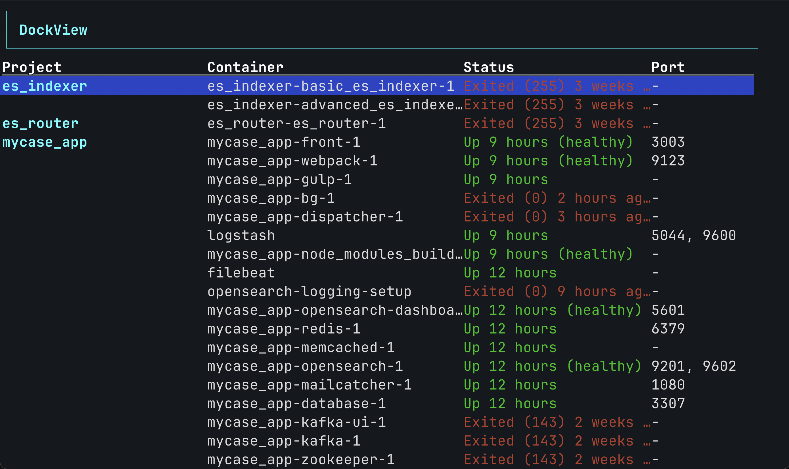
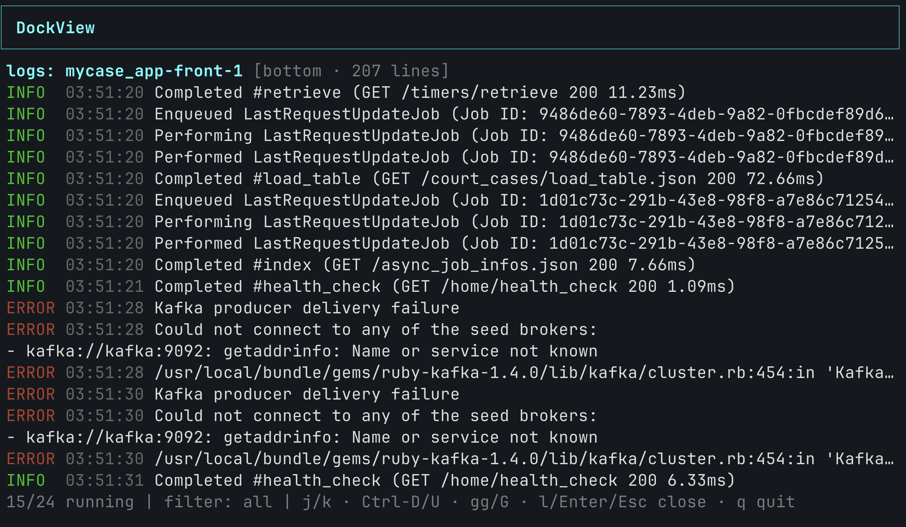

# DockView

Vim-motion TUI: container status + prettified logs in one screen.

I like Docker Desktop but got tired of clicking through it for something I use every day. dockview is a vim-motion TUI: live status and exposed port for every container in the current repo, hit enter for that container's prettified logs, esc back. No new tab, no `docker logs` incantation.




## Features

- Containers grouped by Docker Compose project
- Color-coded status (green = running, red = exited)
- Live log preview inside the same TUI (`l` toggles), formatted through the same JSON pipeline as `dockview fmt`
- Parallel project-wide start/stop/restart
- Auto-refresh every 5 seconds
- Themeable — built-in `default` and `mono`, plus `~/.config/dockview/theme.json`

## Keybindings

| Key | Action |
|-----|--------|
| `j` / `k` | Navigate down / up |
| `gg` | Jump to top |
| `G` | Jump to bottom |
| `r` | Restart container |
| `s` | Start container |
| `c` | Stop container |
| `R` | Restart all containers in project |
| `S` | Start all containers in project |
| `C` | Stop all containers in project |
| `l` / `Enter` | Toggle live log preview for selected container |
| `h` | Toggle all / running only |
| `q` | Quit |



### Preview mode

| Key | Action |
|-----|--------|
| `j` / `k` | Scroll down / up (down = toward newer) |
| `Ctrl-D` / `Ctrl-U` | Half-page scroll |
| `gg` | Jump to start of buffer |
| `G` | Jump back to tail (auto-follow) |
| `l` / `Enter` / `Esc` | Close preview |

## Install

```bash
git clone https://github.com/senorale/dockview.git
cd dockview
make install
```

Installs a shim at `~/.local/bin/dockview`. Ensure it's on your PATH:

```bash
echo 'export PATH="$HOME/.local/bin:$PATH"' >> ~/.zshrc
source ~/.zshrc
```

## Usage

```bash
dockview               # launch TUI (default)
dockview view          # same
dockview --theme mono  # start with the mono theme

# Standalone JSON log pipe — the TUI's preview uses the same formatter internally
docker logs -f --tail 200 <container> 2>&1 | dockview fmt
```

## Theming

Set `$DOCKVIEW_THEME=mono`, pass `--theme mono`, or drop a `~/.config/dockview/theme.json`:

```json
{
  "extends": "default",
  "selectedBg": "magenta",
  "running": "#00ff88"
}
```

## Debugging

`DOCKVIEW_DEBUG=1 dockview` appends debug lines to `~/.claude/dockview/debug.log`. `tail -f` it in another tab.

## Tech stack

- **[Ink 5](https://github.com/vadimdemedes/ink)** — React for the terminal
- **[commander](https://github.com/tj/commander.js)** — CLI arg parsing
- **[execa](https://github.com/sindresorhus/execa)** — subprocess wrangler
- **Docker CLI** — `docker ps`, `docker start|stop|restart`, `docker logs -f`
